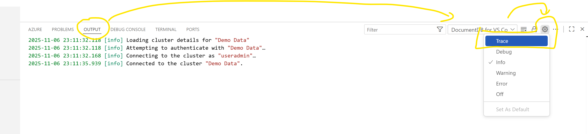

# 🐛 Bug Bash "0.9.0"

### 0. Prerequisites:

1. VS Code installed on your machine
2. `kubectl` installed and on your `PATH` ([install guide](https://kubernetes.io/docs/tasks/tools/))
3. Azure CLI `az` installed ([install guide](https://learn.microsoft.com/cli/azure/install-azure-cli))
4. Access to a Kubernetes cluster with a DocumentDB-compatible workload (see section 2 below)

---

### 1. DocumentDB for VS Code - download here:

- [Download vscode-documentdb-0.9.0-preview.vsix](https://github.com/tnaum-ms/vscode-documentdb-bugbash-090/releases/latest)

- If you are launching VS Code from WSL:
    - Copy the vsix file to your home directory in WSL and then continue with the next step
- In VS Code `Extensions View`, install the extension from the artifact file by selecting `Install from VSIX...` as shown below:

<p align="center"></p>

---

### 2. A Kubernetes cluster with DocumentDB

Choose **one** of the options below.

#### Option A: Use the shared AKS cluster (recommended for the bug bash)

We have a pre-provisioned AKS cluster with DocumentDB deployed via the DocumentDB Kubernetes Operator (DKO).

**Cluster details:**
- **Resource Group:** `bugbash-090-westus2-rg`
- **Cluster Name:** `bugbash-090`
- **Region:** West US 2
- **Subscription:** Project Everest Test Subscription
- **DocumentDB namespace:** `documentdb-instance-ns`
- **Sample data:** `bugbash` database with `products`, `users`, and `events` collections

**To get access via Azure CLI:**

1. Sign in to Azure CLI:
   ```bash
   az login
   ```
2. Get cluster credentials:
   ```bash
   az aks get-credentials \
     --resource-group bugbash-090-westus2-rg \
     --name bugbash-090
   ```
3. Verify access:
   ```bash
   kubectl get namespaces
   kubectl get documentdb -n documentdb-instance-ns
   ```

**Alternative: Paste kubeconfig YAML directly into the extension**

If you cannot use `az aks get-credentials`, use the **Paste kubeconfig YAML from clipboard** option in the extension. The kubeconfig YAML will be shared on Teams.

> **DocumentDB credentials:** Username `docdbadmin` / password `BugBash090!Secure` -- these are pre-filled automatically when connecting via the extension's credential Secret discovery.

#### Option B: Create your own AKS cluster with DKO

Use the [DocumentDB Kubernetes Operator](https://github.com/documentdb/documentdb-kubernetes-operator) automation scripts:

```bash
git clone https://github.com/documentdb/documentdb-kubernetes-operator.git dko
cd dko/documentdb-playground/aks-setup/scripts
az login
./create-cluster.sh --install-all
./test-connection.sh
```

This creates a dev AKS cluster, installs the DKO, and deploys a sample DocumentDB instance. Cleanup when done:

```bash
./delete-cluster.sh --delete-all
```

#### Option C: Use a local cluster

Any local Kubernetes cluster (k3d, minikube, Docker Desktop, kind) with a DocumentDB-compatible workload will work. See the [Getting Started guide](https://github.com/microsoft/vscode-documentdb/blob/next/docs/user-manual/service-discovery-kubernetes-getting-started.md) for local cluster setup instructions.

---

## Where to file the bugs?

- **Confidential / sensitive issues:** reach out directly on Teams
- **Everything else:** file an issue on the [vscode-documentdb](https://github.com/microsoft/vscode-documentdb/issues) repository

---

## ℹ️ FYI

- When filing bugs, please include:
    - Steps to reproduce
    - Expected vs. actual behavior
    - VS Code version and OS
- When using during the bug bash / testing, use `trace` output to help with resolving issues faster. Share the trace output in your report.

<p align="center"></p>

---

## 🆕 What's New in 0.9.0

### ☸️ Kubernetes Service Discovery

The headline feature: DocumentDB-compatible targets running inside Kubernetes clusters can now be discovered and connected to directly from VS Code — no manual connection string assembly required.

Supported cluster environments include **AKS, EKS, GKE, OpenShift**, on-premises clusters, and local clusters such as **kind, minikube, k3s, k3d, Docker Desktop, and Rancher Desktop**.

#### Discovery sources and targets

Discovery uses your kubeconfig to browse contexts → namespaces → services and surface DocumentDB-compatible targets. Three kinds of targets are discovered:

- **DocumentDB Kubernetes Operator (DKO) resources** — `documentdb.io/preview` CRD resources are discovered first and mapped to their backing Service.
- **Opted-in generic Services** — any Service annotated or labelled with `documentdb.vscode.extension/discovery: "true"`.
- **Known-port fallback** — generic Services exposing TCP ports `27017`, `27018`, `27019`, or `10260`.

#### Multiple kubeconfig sources

The **Kubernetes** node in the Service Discovery tree supports multiple independent kubeconfig sources side-by-side:

- **Default kubeconfig** — `KUBECONFIG` env var or `~/.kube/config`
- **Custom kubeconfig file** — any kubeconfig YAML file on disk
- **Pasted kubeconfig YAML** — kubeconfig YAML stored in VS Code Secret Storage

Failures in one source do not affect the others.

#### Context aliases

Auto-generated context names (`clusterUser_…`, `arn:aws:eks:…`, `gke_…`) can be given a friendly display label via **right-click → Rename Context…**. The kubeconfig file is never modified.

#### Endpoint resolution and port forwarding

| Service type | How it connects |
|---|---|
| LoadBalancer | Uses the load-balancer ingress hostname/IP |
| NodePort | Uses node external IPs |
| ClusterIP | Starts a local `kubectl port-forward` tunnel automatically |

ClusterIP tunnels are tracked and reused for the lifetime of the session. You can confirm reuse of an already-occupied local port (e.g. a manually started `kubectl port-forward`).

#### Credentials from Kubernetes Secrets

If a Kubernetes Secret is found (via the DKO `spec.documentDbCredentialSecret` field or the `documentdb.vscode.extension/credential-secret` annotation), the extension pre-fills the username/password in the connection wizard. Credentials are **never** embedded in connection strings or written to logs.

---

## 🎯 Bug Bash Focus

This bug bash is entirely focused on **Kubernetes Service Discovery**. Everything about the discovery tree, the connection wizard, kubeconfig management, context aliases, port forwarding, and credential handling is in scope.

If you already have access to an Azure DocumentDB cluster and want to exercise the existing features (Query Playground, Interactive Shell, Collection View) as a sanity check, go ahead — but the new thing to break is Kubernetes.

---

## 🧪 Test Scenarios

> **These tasks are warm-up exercises.** They've been tested and should work. The real bug bash starts when you go off-script. We're not giving step-by-step instructions, we're giving you **goals**. Explore, poke around, and try to break things.

---

### 0. Find Kubernetes Service Discovery in the UI

<p align="left"></p>

**Goal:** Get oriented. Find the new Kubernetes entry in the Service Discovery tree and understand what it shows out of the box.

1. Open the DocumentDB sidebar.
2. Locate the **Service Discovery** section.
3. Find the **Kubernetes** node and expand it.
4. What sources are listed? Is the **Default kubeconfig** there automatically?
5. Can you expand it to see contexts, namespaces, and targets?

---

### 1. Add a kubeconfig source and browse targets

<p align="left"></p>

**Goal:** Add a kubeconfig source and browse all the way down to a discovered DocumentDB target.

- Click the **`+`** icon on the **Kubernetes** node.
- Try adding a **Default kubeconfig**, a **custom kubeconfig file**, and a **pasted YAML** — at least one of the three.
- Expand the source: contexts → namespaces → services.
- Do namespaces with no DocumentDB targets appear as leaf nodes with a clear description?
- Does expanding a target show the right information?

---

### 2. Connect to a service via the wizard

<p align="left"></p>

**Goal:** Use **New Connection → Service Discovery → Kubernetes** to create a real connection from a discovered target.

- Start the **New Connection** flow and choose **Service Discovery → Kubernetes**.
- Pick a context from the quick pick. Can you tell which source each context belongs to?
- Select a target and complete the wizard.
- Did the extension correctly determine the endpoint type (LoadBalancer / NodePort / ClusterIP)?
- For a **ClusterIP** target: did a port-forward tunnel start? Was the local port prompt clear?
- Can you query the connected cluster?

---

### 3. Rename a context alias

<p align="left"></p>

**Goal:** Test context aliasing so long auto-generated names become readable.

- Right-click a context node in the tree → **Rename Context…**
- Give it a friendly name (e.g. `Prod AKS East`).
- Does the tree label update? Is the original context name still visible in parentheses?
- Does the alias show up correctly in the **New Connection** wizard quick pick?
- Clear the alias (submit empty) and verify the original name is restored.

---

### 4. Manage kubeconfig sources

<p align="left"></p>

**Goal:** Test the source management dialog.

- Click the **key** icon on the **Kubernetes** node → **Manage kubeconfig sources**.
- **Deselect** a source — does it disappear from the tree without being deleted?
- **Re-select** it — does it reappear correctly?
- Add two sources and try to add the same path/YAML twice — does the extension deduplicate?
- **Remove** a non-default source permanently. Are active port-forward tunnels stopped cleanly?

---

### 5. Stress-test port forwarding

<p align="left"></p>

**Goal:** Push port-forward tunnel lifecycle hard.

- Connect to a **ClusterIP** service and use the tunnel to run queries.
- Disconnect and reconnect — is the tunnel reused or a new one started?
- Manually start `kubectl port-forward` on the same local port, then try connecting via the extension. Does the "reuse existing process" prompt appear?
- Kill the backing pod mid-query. What does the extension show?
- Remove the source that owns an active tunnel — are tunnels stopped cleanly?

---

### 6. Freestyle - go wild 🔥

<p align="left"></p>

**Goal:** Do the weird thing. This is the actual bug bash.

- Provide a kubeconfig with zero contexts. Does it fail gracefully?
- Paste invalid YAML. Is the error message helpful?
- Use a kubeconfig pointing to a cluster you have no RBAC access to. Does the error surface cleanly, and do other sources continue to work?
- Rename your kubeconfig file on disk mid-session. What happens?
- Kill your network while a port-forward tunnel is active.
- Try connecting to the same ClusterIP target from two different VS Code windows simultaneously.

> If something feels off: file it. That's why we're here.
